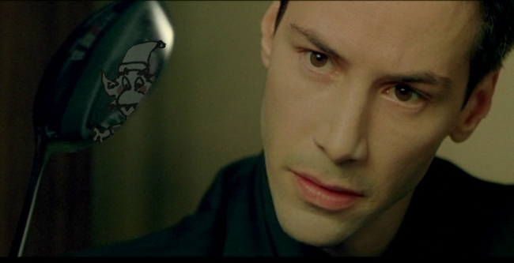

# SPTR

This is the Scottish Physics Teaching Resources (SPTR) website. You can ask about sptr and the Magic Physics Pixies on SPUTNIK. If you don’t know about that, then you’re in the wrong place.

## What happened to the Pixies?
They were slaughtered without mercy in 2016, every last one.

Interestingly, this site (sptr.net), which once served as repository for 10,000 resource files created, shared and used by Scottish Physics Teachers, may yet be pressed back into service. We may need a little voodoo to raise a few of the Magic Physics Pixies from the dead to keep the place tidy.

Imagine that. Zombie Voodoo Magic Physics Pixies. Sleep well.